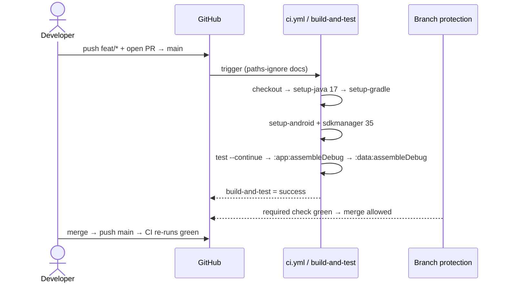
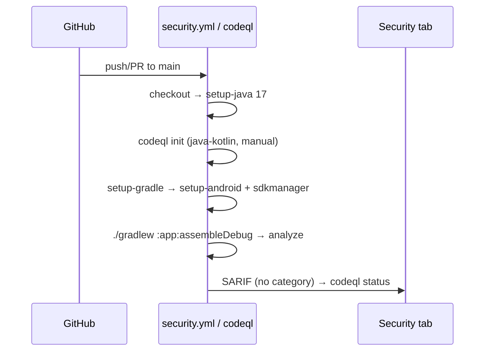
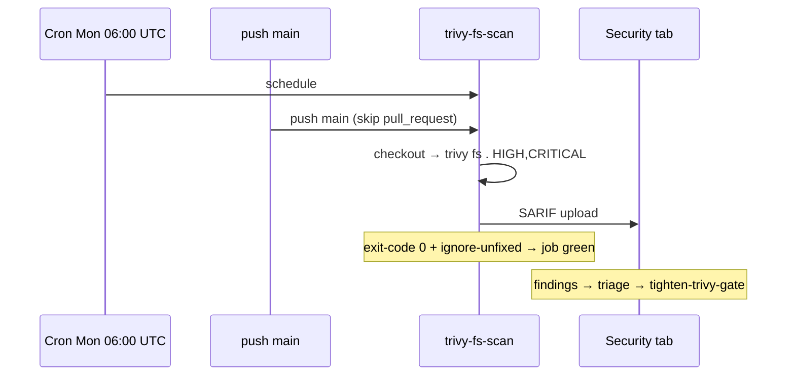

# Design: bootstrap-android-ci

## Context

Operational hardening, not feature work. Zero `.github/` today — `main` is
unprotected and the strict-TDD gate (`./gradlew test`) has no automated signal.
Closes `AGENTS.md` §Out-of-Scope CI bullet; plants emulator landing zone for
`add-alarm-permissions`. Sources: `proposal.md`, `exploration.md` (20 risks),
delta specs `build-system` + `tooling-conventions`. Style template:
`archive/2026-08-06-bootstrap-android-scaffold/design.md`. **Zero Kotlin
touched.** Four artifacts (user-locked).

## Technical Approach

GitHub Actions is a **first-class system boundary** beside the Android module
graph. Workflows invoke Gradle on `:app` / `:domain` / `:data`; they never
bleed into module source. One change, one PR (~250 authored LOC < 400 budget).

```
Actions boundary                         Android modules (unchanged)
┌──────────────────────────┐  Gradle     ┌─────────────────────────┐
│ ci.yml → build-and-test  │ ──────────► │ :app / :domain / :data  │
│   (+ instrumented hook)  │             └─────────────────────────┘
│ security.yml → codeql    │  FS/build analysis → Security tab
│              → trivy-fs-scan
│ dependabot.yml           │  action pin hygiene
│ docs/branch-protection.md│  admin guide (not YAML-enforced)
└──────────────────────────┘
```

## Architecture Decisions

| # | Decision | Choice | Rejected | Rationale |
|---|---|---|---|---|
| D1 | Trivy gate | `exit-code: "0"` + `ignore-unfixed: true` | Fail day-1 | First Android scan finds HIGH/CRITICAL (R4); `tighten-trivy-gate` later |
| D2 | Scope | 4 artifacts | Split CI/Security | One coherent bootstrap |
| D3 | Shape | ONE change | Two OpenSpec changes | Same `.github/` + SDK bootstrap |
| D4 | Emulator | Placeholder in `ci.yml` | Real job now | Additive for `add-alarm-permissions` (R20) |
| D5 | Pins | 1st-party major tags; 3rd-party tag/SHA | `@master` | Supply-chain (R2); Dependabot refreshes |
| D6 | SDK | `setup-android@v4` + `sdkmanager` | Docker image | Runner has no SDK (R1) |
| D7 | CodeQL | `manual`, no `category:`, job perms | `none` / invalid category | Kotlin needs build (R7); category invalid (R3) |
| D8 | Cache | `setup-gradle@v4` only | Extra `actions/cache` | Implicit home + config-cache (R16) |
| D9 | Assemble | + `:data:assembleDebug` | `:app` only | Cheap `:data` gate |
| D10 | Branches | Conventional Commit prefixes | Free-form | Matches commitlint |
| D11 | Worktrees | `../syncalarm-<branch>` docs | Stash-only | Concurrent feat/hotfix |

## CI Pipeline Architecture

**File** `.github/workflows/ci.yml` · **Job** `build-and-test` ·
`ubuntu-latest` · `timeout-minutes: 25` (R5) · future `instrumented-tests`
placeholder only.

| Triggers | Detail |
|---|---|
| `push` | `main` |
| `pull_request` | → `main`; `paths-ignore: ['docs/**', '**.md']` (R15) |
| `workflow_dispatch` | Manual re-run (R10) |

```yaml
concurrency:
  group: ci-${{ github.workflow }}-${{ github.event.pull_request.number || github.ref }}
  cancel-in-progress: true
permissions: {}                    # R9 — no implicit grants
# job: permissions: { contents: read }
```

| # | Step | Why here |
|---|---|---|
| 1 | `actions/checkout@v4` | Source before toolchain |
| 2 | `actions/setup-java@v4` temurin 17 | JDK before Gradle/AGP |
| 3 | `gradle/actions/setup-gradle@v4` | Cache warm; no SDK needed |
| 4 | `android-actions/setup-android@v4` | cmdline-tools + SDK root; `ANDROID_HOME`/`ANDROID_SDK_ROOT` (R18 — no `local.properties`) |
| 5 | `sdkmanager "platforms;android-35" "build-tools;35.0.0" "platform-tools"` | Action omits compileSdk/build-tools (R1) |
| 6 | `./gradlew test --continue` | All 3 modules; full failure signal (R19) |
| 7 | `./gradlew :app:assembleDebug` | = `verify.build_command` |
| 8 | `./gradlew :data:assembleDebug` | D9 |
| 9 | Placeholder comment | Future emulator job (D4) |

**Cache:** `setup-gradle@v4` covers Gradle home + config-cache — **no** separate
`actions/cache@v4`. `gradlew` is mode `755` (R17) — no `chmod`.

## Security Pipeline Architecture

**File** `.github/workflows/security.yml` · triggers: `push`/`pull_request` →
`main`, cron `0 6 * * 1` (Mon 06:00 UTC, default branch only),
`workflow_dispatch`. Top-level `permissions: {}`. Jobs **independent** (no
`needs:`).

### Job `codeql`

`contents: read` + `security-events: write` (job-scoped).  
`languages: java-kotlin` · **no `category:`** (R3) · `build-mode: manual` (R7).

1. checkout → 2. setup-java 17 → 3. `codeql-action/init@v3` → 4. setup-gradle →
5. setup-android + sdkmanager → 6. `./gradlew :app:assembleDebug` →
7. `codeql-action/analyze@v3` → SARIF.

(Spec: init precedes setup-gradle, build, analyze.)

### Job `trivy-fs-scan`

`if: github.event_name != 'pull_request'` (R12).  
`aquasecurity/trivy-action@0.28.0` (not `@master`, R2).  
`scan-type: fs` · `scan-ref: "."` · `severity: HIGH,CRITICAL` ·
`exit-code: "0"` · `ignore-unfixed: true` (D1) · table logs + SARIF upload.

## Sequence Diagrams

### 1. CI happy path



### 2. CodeQL analysis flow



### 3. Trivy scan flow



## Dependency Choices

| Dependency | Version | Why | Not |
|---|---|---|---|
| `actions/checkout` | `v4` | Current major | `v3` deprecated |
| `actions/setup-java` | `v4` | temurin support | `v3` |
| `android-actions/setup-android` | `v4` (SHA pref.) | cmdline-tools + SDK root | older SDK actions / Docker |
| `gradle/actions/setup-gradle` | `v4` | home + config-cache | standalone `actions/cache` |
| `github/codeql-action` | `init@v3` / `analyze@v3` | manual Kotlin build | `v2`; `build-mode: none` |
| `aquasecurity/trivy-action` | `@0.28.0` (SHA pref.) | fixed audited ref | `@master` (R2) |

Policy: 1st-party = major tags; 3rd-party = release tag min, SHA preferred +
`# vX.Y.Z` comment. Never float branch refs.

## File Changes

| File | Action | Description |
|---|---|---|
| `.github/workflows/ci.yml` | Create | `build-and-test` + emulator placeholder |
| `.github/workflows/security.yml` | Create | `codeql` + `trivy-fs-scan` |
| `.github/dependabot.yml` | Create | `github-actions` weekly; gradle deferred |
| `docs/branch-protection.md` | Create | Checks, branch names, worktrees |
| `openspec/specs/build-system/spec.md` | Modify | Merge CI/CodeQL/Trivy/emulator delta |
| `openspec/specs/tooling-conventions/spec.md` | Modify | Branch names, worktrees, CI no longer deferred |
| `AGENTS.md` | Modify | Drop CI out-of-scope bullet |

## Branch Protection (`docs/branch-protection.md` content)

**Rule:** `main` requires PRs + green required checks. Direct push rejected
(Settings → Branches — not workflow YAML).

| Check | Source | Enforce |
|---|---|---|
| `build-and-test` | `ci.yml` | Now |
| `codeql` | `security.yml` | Now |
| `trivy-fs-scan` | `security.yml` | Document now; enforce after `tighten-trivy-gate` |

Also: require branch up-to-date; approving review when 2nd contributor appears.

**Branch names** (commitlint-aligned): `feat/*` `fix/*` `chore/*` `docs/*`
`refactor/*` `test/*` `perf/*` `build/*` `ci/*`. GitHub does not enforce
natively — optional follow-up `branch-name-lint` action.

**Git Worktrees:** siblings `../syncalarm-<branch>`.

| Pattern | How |
|---|---|
| Hotfix switch | `git worktree add ../syncalarm-hotfix main` from feat worktree |
| Parallel reviews | One worktree per PR |
| Concurrent feats | Multiple `feat/*` worktrees |

House rules: never nest worktrees; keep `main` worktree clean. Prefer
worktrees over long-lived `git stash`.

**Forward-compat:** v1 only — later emulator/lint/coverage gates +
`branch-name-lint`.

## Dependabot

```yaml
version: 2
updates:
  - package-ecosystem: "github-actions"
    directory: "/"
    schedule: { interval: "weekly" }
    groups:
      github-actions: { patterns: ["*"] }
```

**Defer** `gradle` (+ `npm` commitlint/Husky) until `libs.versions.toml` is
auto-PR stable — comment the deferral in-file. Dependabot exists so pins do
not rot (R13).

## Forward-Compat Hooks

| Hook | Mechanism | Consumer |
|---|---|---|
| Emulator | Placeholder job for `android-emulator-runner@v2` | `add-alarm-permissions` |
| Trivy tighten | Flip `exit-code: "1"` + PR trigger | `tighten-trivy-gate` |
| Lint / coverage | New jobs | `add-lint-detekt` / `add-coverage-kover` |

OS-scoped Gradle cache shared with future emulator job. Job-level perms let
future jobs add scopes without widening `build-and-test`.

## Non-Goals

No emulator tests · no signed release/Play deploy · no Lint/Detekt · no
Kover/JaCoCo · no PR labeling · no CODEOWNERS · no auto-merge · no
API-enforced branch protection · no Trivy fail-gate (follow-up).

## Threat Matrix

VCS/PR automation boundary applies.

| Boundary | Applicability | Design response | Planned verify |
|---|---|---|---|
| Documentation-like paths | **Applicable** — `paths-ignore` | Docs-only PRs skip CI | Docs PR → no CI; code PR → CI |
| Git repository selection | **N/A** — Actions checkout only | — | — |
| Commit state | **N/A** — CI does not commit | — | — |
| Push state | **Applicable** — concurrency + cancel-in-progress | Latest SHA wins | Force-push cancels prior run |
| PR commands | **Applicable** — event matrix; Trivy skips PR | Least-privilege job perms | Trivy off on PR; CodeQL on PR→main |

## Testing Strategy

| Layer | What | Approach |
|---|---|---|
| Local | Strict TDD intact | `./gradlew test` = 0 (no source touch) |
| Static | Order, pins, perms, triggers | sdd-verify checklist vs design/specs |
| Live | First `main` push / draft PR | Statuses + SARIF on Security tab |
| Negative | Docs PR; Trivy on PR | paths-ignore; Trivy skipped |

## Migration / Rollout

No data migration. Single PR → green `main` run → enable branch protection
manually per doc → triage Trivy → schedule `tighten-trivy-gate`.  
**Rollback:** revert PR. Manual branch protection must be unchecked manually.  
**Caveat:** CodeQL free on public repos; private needs Advanced Security —
confirm `AndresDev28/SyncAlarm` visibility.

## Risks (top 5)

| # | Sev | Risk | Design mitigation |
|---|---|---|---|
| R1 | CRITICAL | No SDK on runner | `setup-android` + `sdkmanager` before every Gradle step |
| R2 | CRITICAL | `trivy@master` float | Pin `@0.28.0` + Dependabot |
| R3 | CRITICAL | Invalid CodeQL `category:` | Omit `category:` |
| R4 | WARNING | Fail-fast breaks day-1 | Warning-only gate (D1) |
| R5 | WARNING | 20-min cold timeout | `timeout-minutes: 25` |

Full register: `exploration.md` §Risks.

## Open Questions

None blocking. All 8 user-locked decisions reflected.

## References

- `openspec/changes/bootstrap-android-ci/{exploration,proposal}.md` + `specs/`
- `openspec/changes/add-alarm-permissions/proposal.md`
- `openspec/changes/archive/2026-08-06-bootstrap-android-scaffold/design.md`
- `openspec/specs/{build-system,tooling-conventions}/spec.md`
- `AGENTS.md` · PRD §6 · `openspec/context/sync-alarm.md`
